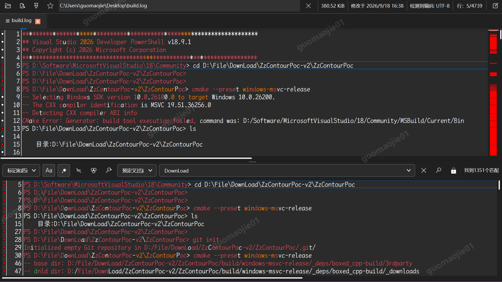

# ZzLogg

ZzLogg is a fast, cross-platform desktop application for browsing, following,
filtering, and searching large or complex log files. It reads files directly
from disk, keeps search results alongside the original log, supports regular
expressions and boolean search expressions, and can follow files while they
grow.

The current source repository is
[gitcode.com/JackfahdinQt/ZzLogg](https://gitcode.com/JackfahdinQt/ZzLogg).



## Features

- Opens very large text files without loading the whole file into memory.
- Searches with Qt regular expressions or the optional Hyperscan backend.
- Combines search expressions with `and`, `or`, and `not`.
- Shows filtered results, match context, marks, and color highlighters.
- Follows growing files and detects appended or overwritten content.
- Opens local files, supported compressed files and archives, remote URLs, and
  clipboard text.
- Supports saved sessions, recent files, favorites, encoding detection, and
  multiple windows.
- Provides Qt 6 build definitions for Windows, Linux, and macOS; target-host
  verification is required for platform packages.

See the [user documentation](docs/DOCUMENTATION.md) for usage details.

## Build

Clone the repository together with its submodules:

```bash
git clone --recursive https://gitcode.com/JackfahdinQt/ZzLogg
cd ZzLogg
```

ZzPureTools remains a pinned submodule. backward-cpp v1.6 is vendored directly
in this repository and does not require separate submodule initialization or a
configure-time download.

The project requires a C++17 compiler, CMake, and Qt 6. The optional UI2 target
requires C++20, CMake 3.23 or later, and Qt 6.8 or later. A typical Ninja build
uses the checked-in presets:

```bash
cmake --preset ninja-release
cmake --build --preset ninja-release
ctest --preset ninja-release
```

If Boost and Ragel are not installed, configure with
`-DKLOGG_USE_HYPERSCAN=OFF` to use the Qt regular-expression backend. Detailed
platform requirements, Windows presets, UI2 commands, install commands, and
the portable-folder target are documented in [docs/BUILD.md](docs/BUILD.md).

## Packaging and installation

The maintained packaging inputs in this repository are CMake install/CPack,
the Windows Qt 6 NSIS script, the Linux desktop entry and icon installation,
and the CMake-generated Windows portable folder. Package creation depends on
the corresponding platform tools and should be verified on its target host.

This repository does not currently advertise a hosted binary-release channel
or package-manager feed. Build or install from the current source tree instead
of relying on historical third-party package instructions.

## Contributing

Please base changes on the current GitCode repository. Keep platform-specific
packaging changes consistent with the central product metadata in
`cmake/ZzLoggBrand.cmake`, and run the relevant CMake/CTest presets before
submitting a change.

## 来源与许可

ZzLogg is derived from [klogg](https://github.com/variar/klogg), which in turn
was forked from [glogg](https://github.com/nickbnf/glogg). The project preserves
the work and attribution of Anton Filimonov, Nicolas Bonnefon, and the other
contributors.

ZzLogg is free software distributed under the GNU General Public License,
version 3 or later (GPLv3+). See [COPYING](COPYING) and [NOTICE](NOTICE) for the
license text and additional notices.
