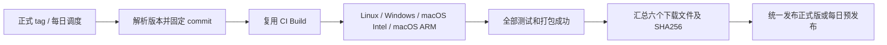

# ZzLogg CI 发布流程

本文说明 tag 正式发布与每日预发布的配置、验证和操作方式。实际构建及发布状态以 GitHub Actions 和 Releases 页面为准。

## 两条发布入口

| 项目 | 正式版 | 每日最新版 |
| --- | --- | --- |
| 工作流 | `Publish`（`.github/workflows/publish.yml`），运行标题 `<tag>` | 同一 `Publish`，运行标题 `Continuous Build` |
| 触发 | 推送 `vYY.MM.PP` tag | 北京时间每天 00:00，或手动运行 |
| 示例 | `v26.09.00` | `continuous-build` |
| 源码 | tag 对应的确切 commit | 调度/手动运行对应的 master commit |
| 是否每次构建 | 是，tag 必须匹配源码版本 | 定时运行无新提交则跳过；手动运行强制重建 |
| GitHub 类型 | 普通 Release | Prerelease，不成为正式版 Latest |
| 更新策略 | 先草稿、上传校验后公开；已公开版本禁止覆盖 | 替换时临时转草稿，同名文件上传校验、旧文件清理后切换 tag 并公开 |

定时表达式为 `0 16 * * *`，使用 UTC，对应北京时间次日 00:00。
这里的 0 点指**请求调度的时间**；GitHub 的 schedule 不保证准点，繁忙时可能延迟甚至丢弃任务，四个平台构建也需要时间，不能承诺 0 点就能下载。公开仓库长期无活动时 GitHub 也可能禁用 schedule，需要到 Actions 页面重新启用。

排查每日版时，在 Actions 的 **Publish** 中查看 `schedule` 事件；`continuous-build` 是发布标签，不再是独立工作流。2026-09-21 的零点任务实际于北京时间 02:39:47 启动，随后 macOS Intel 创建 DMG 失败，最终发布被跳过。需要补发时可在 master 手动运行 Publish，无需创建正式 tag。

`update-feed` 是自动维护的更新清单数据分支，应用从其 `stable.json` / `preview.json` 检查更新。它不承担源码集成或额外的全平台构建；删除分支会使更新源不可用。详情见 [GitHub 更新源](development/GITHUB_UPDATES.md)。



## 参考仓库与取舍

实际参考的是 ZzClawTerm **远端** master 的提交 `63b5cd34272044115894d256358bea613d418737`，不是本机较旧的 Qt 版本工作流：

- [正式发布](https://github.com/jackfahdin/ZzClawTerm/blob/63b5cd34272044115894d256358bea613d418737/.github/workflows/release.yml)
- [每日发布](https://github.com/jackfahdin/ZzClawTerm/blob/63b5cd34272044115894d256358bea613d418737/.github/workflows/continuous-build.yml)

沿用其双入口、北京时间 0 点、无变化跳过、固定源码 SHA、统一汇总平台包的结构。
保留 ZzLogg 已通过 CI 的 Qt 6.11.2、Ubuntu 24.04、Windows 2022、两种 macOS 架构和 checkout v7，不迁入参考仓库的 Rust/Tauri 工具链、六架构矩阵或 GitCode 发布配置。

考虑过三种方式：

1. **复用已验证的 CI 构建（本稿采用）**：普通 CI 和两种发布共享构建、测试及 Linux 安装验收，减少配置漂移；发布时重新构建其固定 commit。
2. 复制两套独立构建矩阵：入口直观，但 Qt 版本、依赖、Linux 修复要维护三遍。
3. 直接提升历史 CI artifact：能节省构建时间，但必须处理 artifact 过期、精确 SHA 匹配及历史产物可信度；本次没有引入。

## 发现的问题及处理

### 1. 同一个 Release 不应由各平台分别写入

各平台独立创建 Release、上传和修改说明，会出现创建竞争及部分平台新、部分平台旧的问题。本稿所有平台只生成 Actions artifacts，唯一的 publish job 等到整个复用构建成功，再收集并检查完整产物。

任一平台失败，publish 不运行，原有正式版和每日版保持可用。发布使用当前 workflow run 的 artifacts，不从“最近一次成功”任务随意取包。

### 2. 每日版覆盖不是原子操作

GitHub 不提供“同时替换所有资产、tag、Release 说明”的原子接口。参考流程先删除全部旧文件再上传，网络失败时可能留下空下载页；它还允许取消正在发布的任务。

每日版使用固定名称 `ZzLogg-Continuous-Build-<平台>-<架构>.<扩展名>`，不再把日期、运行编号和短 SHA 放进附件名。Release 标题固定为 `Continuous Build`，正式版标题仅为版本 tag（如 `v26.09.02`）。

因为 GitHub 不允许同一 Release 同时存在两个同名附件，发布阶段先将每日版临时设为草稿，再替换内容变化的同名文件；大小和 SHA-256 一致的附件直接复用。六个应用包及两份元数据全部通过远端大小和 SHA-256 校验后，删除旧长文件名附件，再移动 `continuous-build` tag 并公开。上传、校验或清理失败会保留草稿和旧 tag，重跑可继续；若最后公开请求失败，tag 可能已移动，草稿可重跑恢复，不能把多个 API 操作视为原子事务。

构建阶段旧每日版继续可用；实际替换阶段下载页及固定直链会短暂不可用，失败后需重跑恢复。发布 job 与 Signed Update Feed 共用并发组，避免签名时包被替换；全平台编译阶段不占该锁。GitHub 同组最多保留一个等待任务，较新的等待任务可能替换旧等待任务，需要重跑被取消的发布。旧客户端缓存的预览清单可能暂时对应旧摘要，仍须通过原有摘要校验，不能因固定 URL 而放松校验。

Windows ZIP 使用固定时间戳，使相同构建产物的失败重跑产生相同摘要。源码 SHA、内部数字版本和 workflow 链接仍保存在 JSON 元数据及 Release 说明中，保留追溯能力。

正式版在草稿中完成上传后才公开；同一 tag 已公开时拒绝覆盖，避免下载内容悄悄改变。草稿可在失败后重试；脚本会通过带认证的 Release 列表查找草稿，因为 GitHub 的按 tag 查询接口仅用于已发布版本。

### 3. 两个 macOS 包原先会同名

原流程只有启用签名时才把 `ZzLogg-版本-OSX.dmg` 改成带架构的名称；当前无签名构建的两个 DMG 会同名。本稿把重命名移到独立步骤，签名与否都生成 `mac-x64.dmg` / `mac-arm64.dmg`，汇总时再统一对外文件名。

Linux artifact 改为只上传顶层 `.deb` / `.rpm`，排除 CPack 的内部暂存目录。

### 4. 版本号不能照搬 continuous / nightly 字符串

项目 CMake、Windows 安装器和应用内更新采用已有的数字版本约定。正式 tag 必须严格匹配源码规范化显示版本：`CMakeLists.txt` 的 `26.9.0` 对应 `v26.09.00`。不接受 `v26.9.0`、`v26.09.00-rc1` 或与源码不一致的 tag。

本稿每日版**不自动修改源码版本，也不把 nightly 字符串塞入安装器**。应用内显示仍是例如 `26.09.00`，源码 SHA 和构建链接写在 Release 说明和 JSON 元数据中。

这意味着不同日期快照可能具有同一个内部包版本。Linux 包管理器未必把新快照判定为升级，需要显式重装；Windows/macOS 界面也不能只靠版本号区分两个快照。如果后续希望应用内显示每日 build、包管理器能比较每日版本，应单独设计安装版本与显示版本的规则，不能仅改外层文件名。

### 5. GitHub Release 不等于应用内自动更新

现有更新模块需要 `stable` / `preview` 身份、单调递增的 releaseSequence、签名清单、公钥及可信下载主机。`ZZLOGG_OFFICIAL_RELEASE` 的身份配置目前还限定为 Windows x64。

本稿只建立 GitHub 手动下载发布通道，**不设置该开关、不填入虚假签名、不生成伪造更新清单**。新增的 `release-info-*.json` 是包溯源信息，不是应用内更新协议。正式 Release 和每日 Prerelease 的区分也不自动等于 updater 的 stable/preview 配置。

### 6. 平台代码签名仍需单独配置

Windows 原有签名步骤被注释；macOS 签名依赖证书 Secrets，且现有签名身份仍是上游作者名称。当前可生成、测试并发布未签名包，但不能把它们宣称为已签名/已公证。启用自己的 macOS 证书前，需同步换成自己的签名身份。安装时的系统提示与 Qt 编译成功是不同事项。

SHA256 校验文件提供下载完整性检查，不替代平台代码签名或更新清单签名。

## 下载文件

每次必须有六个非空应用包，缺少任意平台即拒绝发布：

| 平台 | 正式版文件示例 |
| --- | --- |
| Linux x64 | `ZzLogg-26.09.00-linux-x64.deb`、`.rpm` |
| Windows x64 | `ZzLogg-26.09.00-windows-x64-setup.exe`、`-portable.zip` |
| macOS Intel | `ZzLogg-26.09.00-macos-x64.dmg` |
| macOS Apple Silicon | `ZzLogg-26.09.00-macos-arm64.dmg` |

同时生成 `SHA256SUMS-标签.txt` 和 `release-info-标签.json`，记录实际文件摘要、大小、源码 SHA、应用版本和构建链接。每日版用 `Continuous-Build` 代替版本字段，例如 `ZzLogg-Continuous-Build-windows-x64-setup.exe`。两份元数据分别为 `SHA256SUMS-Continuous-Build.txt` 和 `release-info-Continuous-Build.json`。

Release 只公开安装/便携包及上述元数据，不直接上传 `.app` / `.dSym` 目录。原 Actions artifact 中保留的调试内容不作为正式下载文件。

每日版入口固定为 `https://github.com/jackfahdin/ZzLogg/releases/tag/continuous-build`，Windows 安装包直链固定为 `https://github.com/jackfahdin/ZzLogg/releases/download/continuous-build/ZzLogg-Continuous-Build-windows-x64-setup.exe`。

## 本地文件分工

- `.github/workflows/ci-build.yml`：增加 `workflow_call`，所有平台 checkout 同一个传入 SHA；普通 push/PR 构建保留。
- `.github/workflows/publish.yml`：统一 tag、定时和手动入口，预检并复用构建，发布正式版或每日版。
- `.github/actions/agent-package-mac/action.yml`：无签名包也按架构命名。
- `scripts/ci/prepare_release.py`：一次性解析版本、源码和每日标签。
- `scripts/ci/release_assets.py`：校验平台包、压缩 Windows 便携目录、生成元数据及摘要。
- `scripts/ci/publish_release.py`：GitHub API 查询、草稿恢复、完整上传后公开、每日旧文件清理。
- `tests/ci/test_release.py`：版本、资产完整性、发布顺序和失败恢复测试。

## 验证及上线方式

本地可运行：

```sh
python3 -m unittest discover -s tests/ci -p 'test_*.py' -v
QT_QPA_PLATFORM=offscreen ctest --test-dir out/build/ci-qt6112 --output-on-failure \
  -R 'linux|ci_toolchain|ci_compiler|version_display'
```

工作流还经过 actionlint 语法检查；旧 composite action 的空 description 提示和既有 shellcheck 提示不计入本次语法验证。发布脚本测试使用临时文件和内存中的 GitHub API 替身，不会创建远端 Release。

发布脚本测试覆盖固定命名、完整上传校验、失败重试和已发布旧清单的兼容；Windows 安装器验证边界见下节。

本地验证无法证明 GitHub 实际发布权限、远端上传或所有平台的新 workflow_call 都成功；这些要在审阅后推送并运行一次才能确认。没有为了验证而创建测试 tag、触发远端任务或上传任何资产。

发布操作顺序：提交推送工作流 → 在 master 手动运行 Publish（每日预览版）→ 检查六个文件、元数据和预发布属性 → 再为同版本源码创建正式 tag。master push 不再自动执行全平台 CI；PR、手动 CI 和 Publish 复用同一构建流程。

### macOS DMG 稳定性

CI 通过 `scripts/ci/package_macos_dmg.py` 调用 CPack。关闭磁盘卷图标和 Finder AppleScript 布局，避免制作过程中额外挂载镜像；应用图标和 Applications 链接保留，DMG 使用系统默认窗口布局。创建镜像明确返回 `Resource busy` 时最多尝试 3 次，等待 5 / 10 秒，每次使用独立输出目录。其他错误立即失败，成功后须通过 `hdiutil verify` 才移动到发布目录。

脚本不按 `/Volumes/ZzLogg` 名称强制卸载磁盘，不杀 Finder/Spotlight，不删除可能占用中的镜像。失败时上传 `dmg-diagnostics-<平台>`，保存每次 CPack 输出和磁盘镜像状态。重试不能保证消除 runner 的所有资源竞争，实际稳定性以 macOS CI 为准。

首次正式 tag 的操作示例：

```sh
git tag -a v26.09.00 -m 'ZzLogg 26.09.00'
git push origin v26.09.00
```

两个发布 job 使用当前仓库 `GITHUB_TOKEN` 的 `contents: write`，构建/准备 job 保持只读。仓库 ruleset 如禁止移动 `continuous-build`，须为该专用滚动 tag 调整规则；正式版本 tag 不需要允许重写。

本稿没有迁入参考仓库的 GitCode 镜像、网站发布或 Tauri 自动更新，也没有增加新的平台架构。

## Windows 安装界面与编译器

Windows 安装包使用 Inno Setup 7.1.0，由 `Build-InnoInstaller.ps1` 固定官方下载版本及 SHA-256。Windows 11 风格向导跟随系统明暗主题，支持简体中文、繁体中文和英文。完整运行目录和独立归档包仍共用同一份 staging；`.zzlogg-files.manifest` 继续使用原二进制格式。Windows 安装、覆盖、卸载及受限入口由 Update Smoke 验收，代码签名和一键安装的启用条件不变。
